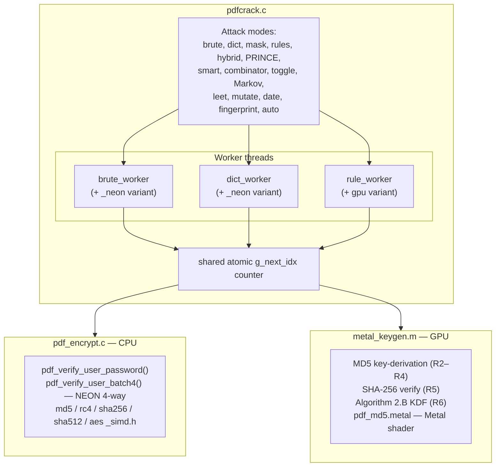

# pdfcracker

[](https://github.com/monahand1023/pdfcracker/releases) [](.) [](.) [](.) [](LICENSE)

Fast PDF password cracker for macOS, optimized for Apple Silicon. Supports all PDF encryption revisions (R2–R6), multiple attack modes, distributed cracking across multiple machines, and auto-selects the fastest acceleration engine at startup.

## Demo

`--fingerprint` mode detects the encryption, benchmarks every available engine, picks the fastest, and sweeps ~1.3M likely passwords (common passwords, keywalks, dates, PINs) — here it recovers the password in under a second on an M4 Pro:

```console
$ pdfcrack -f encrypted.pdf --fingerprint

Crypto : direct MD5+RC4 (R3, 128-bit key)
Metal  : initialized on Apple M4 Pro (max batch: 262144)
Bench  : scalar 51659/s, NEON 86608/s, GPU 91917/s (per-core) — GPU+NEON selected (1304432/s est.)
Target : encrypted.pdf
Threads: 14 + GPU + NEON SIMD
Mode   : fingerprint (common passwords, keywalks, dates, PINs, ~1.3M candidates)
  Phase 1: common passwords (68)...

User password found: test123
```

Other modes — `-d` dictionary (+ `-R` rules / `-H` hybrid), `-b` brute-force, `-m` mask (`test?d?d?d`), `--smart` multi-phase, and `--prince`:

```console
$ pdfcrack -f encrypted.pdf -m "test?d?d?d"
Mode   : mask attack ("test?d?d?d", keyspace 1000)
[####...............................]  12.4%  124/1000  248/s  1s
User password found: test123
```

## Requirements

- macOS (Apple Silicon recommended; Intel supported)
- Xcode Command Line Tools: `xcode-select --install`

No external dependencies. Everything uses CommonCrypto, CoreGraphics, and Metal — all built into macOS.

## Build

```bash
git clone <repo-url> && cd pdfcracker
make          # builds pdfcrack, server, client, test_all
make test_all && ./test_all   # run unit tests (44 tests, 8 PDF variants)
bash test_integration.sh      # run end-to-end integration tests (41 tests)
```

---

## Architecture



### Key files

| File | Role |
|------|------|
| `pdfcrack.c` | Standalone cracker: all attack modes, worker threads, progress, checkpoints |
| `pdf_encrypt.c` | PDF encryption parser and all crypto verification (R2–R6) |
| `pdf_encrypt.h` | Public API for the parser/crypto layer |
| `md5_simd.h` | ARM NEON 4-way parallel MD5 (header-only) |
| `rc4_inline.h` | Inline RC4 replacing CommonCrypto; includes `rc4_first_byte` early-exit |
| `sha256_simd.h` | ARM NEON SHA-256 intrinsics (header-only) |
| `sha512_simd.h` | ARM NEON SHA-384/512 intrinsics (header-only) |
| `aes_simd.h` | ARM Crypto Extensions AES-128-CBC (header-only) |
| `metal_keygen.m` | Objective-C Metal pipeline: MD5 (R2–R4), SHA-256 (R5), Algorithm 2.B (R6) |
| `metal_keygen.h` | Metal pipeline public API |
| `pdf_md5.metal` | Metal GPU compute shader for MD5 key derivation |
| `saslprep.c` | SASLprep Unicode normalization for R5/R6 passwords |
| `server.c` | Distributed coordinator: lease-based work distribution + local cracking |
| `client.c` | Distributed worker node: supports all GPU acceleration |
| `protocol.h` | Text-line TCP protocol for server↔client communication |
| `fuzz_rules.c` | Fuzzer for the rules engine |
| `test_all.c` | Unit test suite: 44 tests across 8 PDF variants |
| `test_integration.sh` | 41 end-to-end integration tests |
| `Makefile` | Build system; includes `pgo` target for profile-guided optimization |

---

## How PDF Encryption Works

PDF uses five distinct encryption schemes, each progressively stronger.

### R2 — 40-bit RC4 (PDF 1.1–1.3)

1. Pad the candidate password to 32 bytes using a fixed padding constant.
2. MD5-hash the padded password concatenated with document metadata (O value, permissions, file ID).
3. Truncate to 5 bytes → encryption key.
4. RC4-encrypt the 32-byte padding constant with that key.
5. Compare the result to the stored `/U` value.

Fast: one MD5 + one RC4 pass. Extremely weak by modern standards.

### R3/R4 — 128-bit RC4 or AES-128 (PDF 1.4–1.6)

Same as R2 but with a 16-byte key and **50 additional MD5 iterations** on the key bytes, then **20 RC4 passes** with XOR-modified keys for the final comparison. The 50-iteration MD5 and 20-pass RC4 are the bottleneck for multi-core scaling.

### R5 — AES-256 / SHA-256 (PDF 1.7 ext3)

Simple: `SHA-256(password + validation_salt)` compared to the stored hash. No iteration, no RC4. Very fast for a GPU that can run thousands of SHA-256 operations in parallel.

### R6 — AES-256 / SHA-256 + iterative KDF (PDF 2.0)

Deliberately expensive. Algorithm 2.B runs a loop of SHA-256/384/512 + AES-CBC operations where the iteration count (64+) is determined by the hash output each round. Each verification takes ~60–70 μs, making brute-force impractical at scale. The specific hash variant per round (SHA-256, 384, or 512) also varies, requiring all three to be implemented.

### Owner vs. User Passwords

PDF encryption stores two passwords:
- **User password** (R2–R4): verified by encrypting a known constant and comparing to `/U`.
- **Owner password** (R2–R4): stored as a separate key derivation (Algorithm 3) — the owner key decrypts the `/O` value to recover the user password, which is then verified against `/U`. This is why GPU-derived user keys cannot be used directly for owner password checks.

---

## Acceleration Architecture

### Engine selection

At startup, pdfcracker benchmarks all three engines on the actual PDF and picks the best combination:

```
Bench: scalar 49K/s, NEON 82K/s, GPU 87K/s (per-core) — GPU+NEON selected (1.32M/s est.)
```

| Revision | Best Engine | Why |
|----------|-------------|-----|
| R2 | NEON | GPU MD5 is slower than 14×NEON for 40-bit |
| R3/R4 | GPU + NEON (simultaneous) | GPU handles large batches; NEON fills gaps |
| R5 | GPU | Full SHA-256 on-chip; CPU can't compete |
| R6 | GPU + CPU cooperative | Shared work counter; both contribute |

### NEON 4-way parallel MD5 (`md5_simd.h`)

ARM NEON registers hold 4 × 32-bit lanes. `md5_x4()` runs four independent MD5 computations simultaneously — one per lane — achieving ~4× throughput on the key-derivation step vs scalar. For R3/R4 the gain is bounded by the serial 20-pass RC4 verification, yielding ~1.5× end-to-end over 14 scalar cores.

`pdf_verify_user_batch4()` / `pdf_verify_owner_batch4()` in `pdf_encrypt.c` are the NEON-accelerated entry points. They accept 4 passwords, run 4-way SIMD MD5, then verify each RC4 result serially.

### Inline RC4 (`rc4_inline.h`)

The original implementation called CommonCrypto's `CCCrypt(kCCAlgorithmRC4)` per password, incurring ~20 function calls per R3/R4 candidate. `rc4_inline.h` replaces this with a header-only implementation:

- `rc4_encrypt()` — general purpose
- `rc4_encrypt_16()` — 16-byte specialization for R3/R4 inner loop
- `rc4_first_byte()` — computes only the first output byte; rejects ~255/256 candidates instantly without running full RC4

The early-exit alone eliminates full RC4 computation for 99.6% of wrong candidates in R2, and is guarded to skip owner-password checks correctly (the GPU-derived user key is always wrong for owner candidates — the check must reach `pdf_verify_owner_password()` regardless).

### Metal GPU pipeline (`metal_keygen.m`, `pdf_md5.metal`)

Three separate Metal pipelines share one `.metallib`:

| Pipeline | Used for | GPU does | CPU does |
|----------|----------|----------|----------|
| `metal_keygen` | R2–R4 | Algorithm 2 MD5 key derivation | RC4 verification |
| `metal_sha256` | R5 | Full Algorithm 3.2 SHA-256 verify | Nothing |
| `metal_r6` | R6 | Full Algorithm 2.B KDF | Overflow candidates |

All three use **async double-buffered dispatch**: while the GPU processes batch N, the CPU is preparing batch N+1 and verifying batch N−1. For R6, sub-batch dispatching splits each GPU batch so the CPU can detect a match mid-batch and abort early.

### Shared work counter

GPU workers and CPU/NEON workers compete for the same `g_next_idx` atomic counter. Each NEON worker grabs `NEON_WORK_CHUNK` (2048) candidates per fetch; the GPU grabs `GPU_BATCH_SIZE` (up to 262,144). This eliminates a dedicated dispatcher thread and lets both engines self-schedule based on their natural throughput.

### NEON SHA-256/384/512 intrinsics (`sha256_simd.h`, `sha512_simd.h`)

Used in the R6 CPU path. The Algorithm 2.B KDF inner loop calls SHA-256, SHA-384, or SHA-512 depending on intermediate hash values. ARM Crypto Extensions (`vsha256h_u32`, SHA-512 equivalents) run these operations in hardware, giving ~11% throughput improvement over CommonCrypto for CPU-side R6 cracking.

### NEON AES (`aes_simd.h`)

AES-128-CBC used in the R6 KDF. ARM Crypto Extensions (`vaeseq_u8`, `vaesmcq_u8`) replace table-lookup AES with direct hardware instructions.

---

## Attack Modes

| Mode | Flag | Description |
|------|------|-------------|
| Dictionary | `-d <wordlist>` | Try each word in a wordlist, optionally with `--reverse` |
| Brute-force | `-b [-l <max>] [-c <charset>]` | Enumerate all combinations; default charset a–z A–Z 0–9 |
| Mask | `-m <pattern>` | `?l`=lower `?u`=upper `?d`=digit `?s`=special `?a`=all `?w`=dict word |
| Rules | `-R <file>` | Apply hashcat-compatible rules to dictionary words |
| Hybrid | `-H <N>` or `-H <mask>` | Append N-char brute-force or mask-pattern to dict words |
| PRINCE | `-P` | Probabilistic word-chain generation from dictionary pairs |
| Smart | `--smart` | Multi-phase intelligent attack (see below) |
| Combinator | `--combinator <dict2>` | Cartesian product of two wordlists |
| Toggle-case | `--toggle` | All case variants of dictionary words |
| Mask + Rules | `-m <pat> -R <file>` | Apply rules to mask-generated candidates |
| Markov | `-I -M <model>` | Probability-ordered brute-force from trained model |
| Mutate | `--mutate` | Common substitutions (a→@, e→3, etc.) on dict words |
| Leet | `--leet` | Extended leet-speak substitutions on dict words |
| Date | `--date` | All date formats (YYYYMMDD, DDMMYYYY, etc.) for 1940–2026 |
| Fingerprint | `--fingerprint` | Common weak patterns: dates, keyboard walks, PIN formats |
| Auto | `-A` | Chains dict → rules → freq brute 1–6 → brute 7–max |
| Reverse | `--reverse` | Also try reversed words in dictionary mode |
| Dedup | `--dedup` | Skip duplicate candidates after rule application |

### Smart mode (`--smart`)

A Passware-style multi-phase attack ordered by real-world probability:

1. **Metadata seeds** — passwords derived from PDF author, title, filename
2. **Common passwords** — curated list of 68 frequent passwords
3. **Seed mutations** — case variants, digits appended, l33t substitutions, reversal
4. **User dictionary + reversals** — if `-d` provided, tries words and `reverse(word)` via GPU+NEON *(moved early so a small targeted wordlist isn't buried under 111M PINs)*
5. **PINs** — all digit-only strings 1–8 characters (111M candidates)
6. **Date patterns** — all formats for 1940–2026 (~191K candidates)
7. **Keyboard walks** — common patterns (qwerty, qaz, etc.)
8. **Name + suffix** — common names with digit/year/symbol suffixes
9. **Name + date combos** — name × full date cross-product
10. **Short brute-force** — lowercase 1–6, alphanumeric 1–5, full 6–7

---

## Options Reference

| Flag | Description |
|------|-------------|
| `-f <file>` | PDF to crack (required) |
| `-d <wordlist>` | Dictionary file |
| `-b` | Brute-force mode |
| `-l <N>` | Max password length for brute-force (default: 4) |
| `-c <chars>` | Custom charset |
| `-t <N>` | CPU thread count (default: all cores) |
| `-G` | Disable GPU acceleration |
| `-O` / `-U` | Crack owner / user password only (default: both) |
| `-r` | Resume from checkpoint |
| `-F` | Frequency-ordered charset (common chars first) |
| `-B` | Benchmark mode: measure and report speed, then exit |
| `-i` | Interactive mode — prompts for password hints |
| `--no-pot` | Don't read or write the pot file |
| `--pot-file <path>` | Custom pot file location |
| `--progress-file <path>` | Write JSON progress for external monitoring |
| `--max-rounds <N>` | Limit R6 KDF rounds (speeds up cracking, may miss some) |
| `--gpu-batch <N>` | Override GPU batch size |
| `--json` | JSON output mode |
| `--session <name>` | Named session (used as checkpoint prefix) |
| `--dedup` | Deduplicate candidates after rule expansion |
| `--reverse` | Also try word reversals in dictionary mode |
| `--metadata-seeds` | Add PDF metadata words to dictionary |
| `--markov-train <file>` | Train a Markov model from a wordlist |
| `--markov-output <file>` | Output path for trained model |

---

## Checkpoints

Any attack mode (Ctrl+C or network drop) saves a checkpoint beside the PDF. Resume with `-r`:

```bash
./pdfcrack -f document.pdf -b -l 8 -r            # resume brute-force
./pdfcrack -f document.pdf -m "?u?u?d?d?d?d" -r  # resume mask
./pdfcrack -f document.pdf -d words.txt -A -r     # resume auto mode
```

Checkpoints store: attack mode, current position (word index or brute-force index+length), charset, mask pattern, hybrid suffix, auto-mode phase, and reverse/dedup flags.

---

## Performance

Measured on M4 Pro (14 cores + 20-core GPU), Apple Silicon Mac mini 2024. Speeds are from the live progress meter during an actual attack run.

| Revision | Algorithm | Best Speed | Engine |
|----------|-----------|-----------|--------|
| R2 | 40-bit RC4 | **~5.5M/s** | 14 cores NEON SIMD |
| R3 | 128-bit RC4 | **~265K/s** | GPU + 14 cores NEON |
| R4 | AES-128 | **~245K/s** | GPU + 14 cores NEON |
| R5 | AES-256/SHA-256 | **~45M/s** | Metal GPU |
| R6 | AES-256/SHA-256+KDF | **~15.6K/s** | GPU+CPU cooperative |

R2 is fast because MD5 parallelises well with NEON and there's only one RC4 pass.
R3/R4 are slower because 20-pass RC4 is serial and memory-bound, limiting the NEON 4× MD5 gain to ~1.5× end-to-end.
R5 is the fastest in absolute terms because SHA-256 runs entirely on-chip with no CPU round-trip.
R6 is deliberately slow by design — the KDF takes ~65 μs per candidate regardless of hardware.

### Single-core vs. CoreGraphics API

| Revision | Direct Crypto | CoreGraphics | Speedup |
|----------|--------------|--------------|---------|
| R2 | ~960K/s | ~20K/s | **~48×** |
| R3 | ~50K/s | ~5.3K/s | **~9×** |
| R4 | ~50K/s | ~5.2K/s | **~10×** |
| R5 | ~22M/s | ~20K/s | **~1,100×** |
| R6 | ~3.3K/s | ~580/s | **~5.7×** |

### Time-to-crack estimates (single M4 Pro)

**R3 @ 265K/s, 62-char charset:**

| Length | Keyspace | Time |
|--------|----------|------|
| 4 | 15M | ~57 seconds |
| 5 | 931M | ~1 hour |
| 6 | 57.7B | ~60 hours |
| 7 | 3.5T | ~154 days |

**R5 @ 45M/s, 62-char charset:**

| Length | Keyspace | Time |
|--------|----------|------|
| 5 | 931M | ~21 seconds |
| 6 | 57.7B | ~21 minutes |
| 7 | 3.5T | ~22 hours |
| 8 | 221T | ~57 days |

**R6 @ 15.6K/s, 62-char charset:**

| Length | Keyspace | Time |
|--------|----------|------|
| 4 | 15M | ~16 minutes |
| 5 | 931M | ~17 hours |
| 6 | 57.7B | ~43 days |

See `BENCHMARKS.md` for full engine comparison tables and detailed methodology.

---

## Distributed Cracking

For large keyspaces, multiple Macs on the same network can share work. The server coordinates all work and also cracks locally; clients join and add capacity.

### Security model

**This protocol is designed for a trusted LAN only.**

- The work protocol is unauthenticated: any machine that can reach the server port can register as a worker and receive chunks of the keyspace.
- The target PDF and the downloaded `client` binary both cross the network in cleartext HTTP.
- Do not expose the server port to an untrusted network.
- **Preferred bootstrap**: use `deploy.sh` (SSH push) instead of the `curl|bash` HTTP pull wherever possible — SSH encrypts both the binary and the PDF.
- If you must use HTTP, run the session inside a VPN or trusted subnet, and use `--auth-token` to at least gate the dashboard and API endpoints.
- The `join.sh` bootstrap script is intentionally exempt from the `--auth-token` check (it is the unauthenticated entry point for new workers), so it must only be reachable on a trusted network.

### Protocol

The server↔client protocol (`protocol.h`) is text-line TCP:

```
Client → HELLO <ncores> <uuid> <version>
Server → CONFIG BRUTE <maxlen> / CONFIG DICT
          CHARSET <chars>
          PDF <nbytes>
          <raw bytes>
Client → READY
--- work loop ---
Client → GETWORK <tested> <elapsed_secs>
Server → BRUTE <length> <start> <end> <lease_id>
      or DICT <count> <lease_id> + word lines
      or FOUND <password> / DONE / ABORT
Client → HEARTBEAT <lease_id> <tested_so_far>
Server → OK / ABORT
Client → COMPLETE <lease_id> <tested>
      or FOUND <password> <lease_id>
```

Work is issued in **leased chunks** with deadlines. If a client disconnects or goes silent past its heartbeat interval, the chunk is re-queued automatically. Clients reconnect with exponential backoff and resume from their last reported position.

### Starting a distributed session

**On the server Mac:**
```bash
./server -f document.pdf -b -l 10        # brute-force
./server -f document.pdf -d wordlist.txt  # dictionary
./server -f document.pdf -b -l 10 -p 8888  # custom port (default: 9999)
```

**Join from another Mac (pull):**
```bash
curl http://<server-ip>:9999/join.sh | bash
```
The client binary is transferred over HTTP and launched automatically. It installs to `~/.pdfcracker/`.

**Or push from the server (requires SSH):**
```bash
./deploy.sh user@other-mac.local
./deploy.sh user@mac1.local & ./deploy.sh user@mac2.local & wait  # parallel
```

**Resume after restart:**
```bash
./server -f document.pdf -b -l 10 -R document.pdf.server.ckpt
```

Each client has a persistent UUID (`~/.pdfcracker_id`) so the server recognises reconnections and avoids re-issuing already-completed work.

---

## Testing

```bash
make test_all && ./test_all        # 44 unit tests, 8 PDF variants (R2–R6)
bash test_integration.sh           # 41 end-to-end tests
```

`test_all.c` verifies every verify function against Apple's CoreGraphics API and tests the NEON batch4 path against scalar results. `test_integration.sh` covers all attack modes end-to-end including checkpoints, GPU/CPU consistency, smart mode, distributed protocol basics, and edge cases.

---

## Supported Encryption

| Revision | Standard | Algorithm | Status |
|----------|----------|-----------|--------|
| R2 | PDF 1.1–1.3 | 40-bit RC4 | ✓ Direct crypto |
| R3 | PDF 1.4–1.5 | 128-bit RC4 | ✓ Direct crypto |
| R4 | PDF 1.6 | 128-bit RC4 or AES-128 | ✓ Direct crypto |
| R5 | PDF 1.7 ext3 | AES-256 / SHA-256 | ✓ Direct crypto + GPU |
| R6 | PDF 2.0 | AES-256 / SHA-256+KDF | ✓ Direct crypto + GPU |
